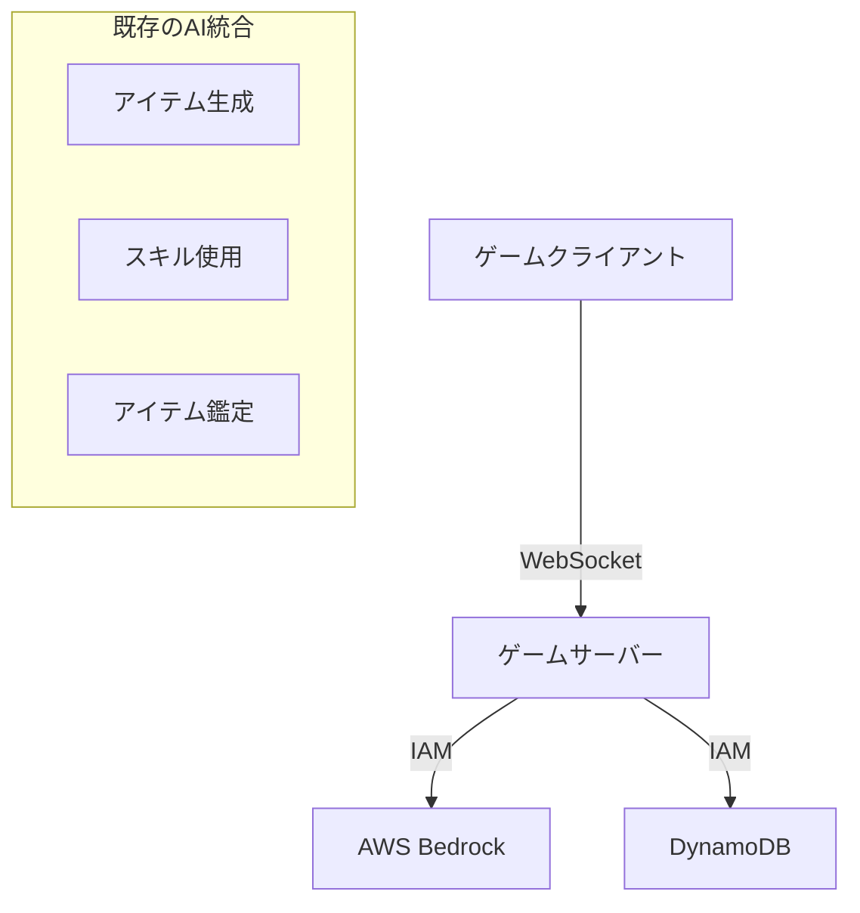
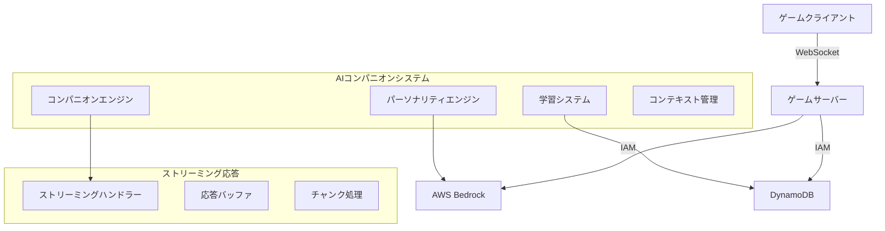

# 設計ドキュメント

## 概要

Spirit of KiroゲームにAIアシスタント・コンパニオン機能を追加します。この機能は既存のAWS Bedrock統合を拡張し、各プレイヤーに専属のAIコンパニオンを提供します。コンパニオンはプレイヤーの行動を学習し、リアルタイムでパーソナライズされたアドバイスとサポートを提供します。

## アーキテクチャ

### 現在のシステム


### 新しいAIコンパニオンシステム


## コンポーネントと インターフェース

### 1. AIコンパニオンエンジン

#### コアコンパニオンクラス
```typescript
interface AICompanion {
    userId: string;
    personalityType: PersonalityType;
    learningData: LearningProfile;
    contextHistory: ContextEntry[];
    preferences: CompanionPreferences;
}

enum PersonalityType {
    ADVENTURER = 'adventurer',    // 冒険家：リスクを取ることを推奨
    SCHOLAR = 'scholar',          // 学者：分析的で詳細な説明
    MERCHANT = 'merchant',        // 商人：利益と効率を重視
    CRAFTSMAN = 'craftsman'       // 職人：品質と技術を重視
}

interface LearningProfile {
    craftingPatterns: CraftingPattern[];
    itemPreferences: ItemPreference[];
    playStyle: PlayStyleMetrics;
    successfulStrategies: Strategy[];
    commonMistakes: Mistake[];
}

interface ContextEntry {
    timestamp: string;
    action: GameAction;
    items: string[];
    result: ActionResult;
    companionAdvice?: string;
}
```

#### コンパニオンサービス
```typescript
class CompanionService {
    async initializeCompanion(userId: string): Promise<AICompanion>;
    async getAdvice(userId: string, context: GameContext): Promise<string>;
    async streamAdvice(userId: string, context: GameContext, callbacks: StreamCallbacks): Promise<void>;
    async updateLearningData(userId: string, action: GameAction, result: ActionResult): Promise<void>;
    async analyzeInventory(userId: string, items: Item[]): Promise<InventoryAnalysis>;
    async suggestCraftingCombinations(userId: string, availableItems: Item[]): Promise<CraftingSuggestion[]>;
}
```

### 2. WebSocketメッセージハンドラー

#### 新しいメッセージタイプ
```typescript
// コンパニオン関連メッセージ
interface CompanionChatMessage {
    type: 'companion-chat';
    body: {
        message: string;
        context?: GameContext;
    };
}

interface CompanionAdviceRequest {
    type: 'companion-advice';
    body: {
        situation: 'crafting' | 'inventory' | 'selling' | 'general';
        items?: string[];
        targetAction?: string;
    };
}

interface CompanionPersonalityUpdate {
    type: 'companion-personality';
    body: {
        personalityType: PersonalityType;
    };
}

interface CompanionStreamResponse {
    type: 'companion-stream';
    body: {
        chunk: string;
        isComplete: boolean;
        messageId: string;
    };
}
```

#### 新しいハンドラー
- `companion-chat.ts` - 自然言語での会話
- `companion-advice.ts` - 状況別アドバイス要求
- `companion-personality.ts` - パーソナリティ設定
- `companion-learning.ts` - 学習データ更新

### 3. ストリーミング応答システム

#### ストリーミングマネージャー
```typescript
class StreamingManager {
    private activeStreams: Map<string, StreamSession> = new Map();
    
    async startStream(userId: string, messageId: string): Promise<StreamSession>;
    async sendChunk(userId: string, messageId: string, chunk: string): Promise<void>;
    async endStream(userId: string, messageId: string): Promise<void>;
    async cancelStream(userId: string, messageId: string): Promise<void>;
}

interface StreamSession {
    messageId: string;
    userId: string;
    startTime: Date;
    chunks: string[];
    isActive: boolean;
}
```

#### プロンプト拡張
```typescript
// 既存のpromptsシステムを拡張
export const generateCompanionAdvice = async function (
    companion: AICompanion,
    context: GameContext,
    callbacks: CompanionStreamCallbacks
): Promise<void> {
    const personalityPrompt = getPersonalityPrompt(companion.personalityType);
    const learningContext = buildLearningContext(companion.learningData);
    const gameContext = buildGameContext(context);
    
    const prompt = {
        system: [
            {
                text: `${personalityPrompt}
                
                あなたは${companion.personalityType}タイプのAIコンパニオンです。
                プレイヤーの専属アシスタントとして、以下の学習データに基づいて
                パーソナライズされたアドバイスを提供してください：
                
                ${learningContext}
                
                応答は自然な日本語で、親しみやすく、具体的で実用的なものにしてください。
                `
            }
        ],
        messages: [
            {
                role: 'user',
                content: [{ text: gameContext }]
            }
        ]
    };
    
    await invokeStream(prompt, callbacks.onChunk, callbacks.onComplete);
};
```

### 4. 学習・分析システム

#### 学習データ収集
```typescript
interface GameActionTracker {
    trackCrafting(userId: string, toolItem: Item, targetItems: Item[], result: CraftingResult): Promise<void>;
    trackItemUsage(userId: string, item: Item, usage: ItemUsage): Promise<void>;
    trackSelling(userId: string, item: Item, price: number, happiness: number): Promise<void>;
    trackInventoryManagement(userId: string, action: InventoryAction): Promise<void>;
}

class LearningAnalyzer {
    async analyzeCraftingPatterns(userId: string): Promise<CraftingPattern[]>;
    async identifyPreferences(userId: string): Promise<ItemPreference[]>;
    async calculatePlayStyle(userId: string): Promise<PlayStyleMetrics>;
    async detectSuccessfulStrategies(userId: string): Promise<Strategy[]>;
    async identifyCommonMistakes(userId: string): Promise<Mistake[]>;
}
```

#### パーソナライゼーションエンジン
```typescript
class PersonalizationEngine {
    async generatePersonalizedAdvice(
        companion: AICompanion, 
        situation: GameSituation
    ): Promise<PersonalizedAdvice>;
    
    async adaptPersonality(
        companion: AICompanion, 
        playerFeedback: PlayerFeedback
    ): Promise<AICompanion>;
    
    async predictPlayerNeeds(
        companion: AICompanion, 
        currentContext: GameContext
    ): Promise<PredictedNeed[]>;
}
```

### 5. クライアントサイドUI

#### 新しいVueコンポーネント
```typescript
// CompanionChat.vue - メインのコンパニオンチャット画面
interface CompanionChatProps {
    companion: AICompanion;
    isVisible: boolean;
}

// CompanionWidget.vue - 常時表示のコンパニオンウィジェット
interface CompanionWidgetProps {
    companion: AICompanion;
    currentAdvice?: string;
    isStreaming: boolean;
}

// CompanionPersonalitySelector.vue - パーソナリティ選択画面
interface PersonalitySelectorProps {
    currentPersonality: PersonalityType;
    onPersonalityChange: (type: PersonalityType) => void;
}

// CompanionAdvicePanel.vue - 状況別アドバイス表示
interface AdvicePanelProps {
    advice: CompanionAdvice[];
    situation: GameSituation;
}
```

#### ストア統合
```typescript
// stores/companion.ts
export const useCompanionStore = defineStore('companion', () => {
    const companion = ref<AICompanion | null>(null);
    const currentAdvice = ref<string>('');
    const isStreaming = ref(false);
    const chatHistory = ref<ChatMessage[]>([]);
    
    const initializeCompanion = async (personalityType: PersonalityType) => {
        // WebSocket経由でコンパニオン初期化
    };
    
    const sendMessage = async (message: string) => {
        // ストリーミングチャット送信
    };
    
    const requestAdvice = async (situation: GameSituation) => {
        // 状況別アドバイス要求
    };
    
    return {
        companion,
        currentAdvice,
        isStreaming,
        chatHistory,
        initializeCompanion,
        sendMessage,
        requestAdvice
    };
});
```

## データモデル

### DynamoDBテーブル設計

#### Companionsテーブル
```typescript
interface CompanionRecord {
    userId: string;                    // Partition Key
    personalityType: PersonalityType;
    createdAt: string;
    lastInteraction: string;
    totalInteractions: number;
    preferences: CompanionPreferences;
}
```

#### CompanionLearningテーブル
```typescript
interface LearningRecord {
    userId: string;           // Partition Key
    actionType: string;       // Sort Key (crafting, selling, inventory, etc.)
    timestamp: string;
    actionData: any;
    result: any;
    success: boolean;
    ttl?: number;            // 古いデータの自動削除用
}
```

#### CompanionContextテーブル
```typescript
interface ContextRecord {
    userId: string;          // Partition Key
    sessionId: string;       // Sort Key
    contextEntries: ContextEntry[];
    createdAt: string;
    ttl: number;            // セッション終了後24時間で削除
}
```

### インメモリキャッシュ
```typescript
// Redis/メモリキャッシュでの高速アクセス
interface CompanionCache {
    activeCompanions: Map<string, AICompanion>;
    recentAdvice: Map<string, string[]>;
    streamingSessions: Map<string, StreamSession>;
}
```

## エラーハンドリング

### エラータイプ定義
```typescript
enum CompanionErrorType {
    COMPANION_NOT_INITIALIZED = 'companion_not_initialized',
    STREAMING_FAILED = 'streaming_failed',
    LEARNING_DATA_CORRUPT = 'learning_data_corrupt',
    PERSONALITY_INVALID = 'personality_invalid',
    CONTEXT_TOO_LARGE = 'context_too_large',
    RATE_LIMIT_EXCEEDED = 'rate_limit_exceeded'
}
```

### エラーハンドリング戦略
1. **ストリーミングエラー**: 部分的な応答でも有用な情報を提供
2. **学習データエラー**: デフォルト動作にフォールバック
3. **AIモデルエラー**: 既存のモデルフォールバック機能を活用
4. **レート制限**: 適切なクールダウンとユーザー通知

## パフォーマンス最適化

### 1. ストリーミング最適化
```typescript
// チャンクサイズとバッファリング最適化
const STREAMING_CONFIG = {
    chunkSize: 50,           // 文字数
    bufferTimeout: 100,      // ms
    maxConcurrentStreams: 5, // ユーザーあたり
    streamTimeout: 30000     // ms
};
```

### 2. 学習データ最適化
```typescript
// 学習データの効率的な管理
const LEARNING_CONFIG = {
    maxContextEntries: 100,     // セッションあたり
    dataRetentionDays: 30,      // 学習データ保持期間
    analysisInterval: 3600,     // 分析実行間隔（秒）
    batchSize: 50              // バッチ処理サイズ
};
```

### 3. キャッシュ戦略
```typescript
// 多層キャッシュシステム
interface CacheStrategy {
    companionData: 'memory',      // 5分間
    recentAdvice: 'memory',       // 1時間
    learningPatterns: 'redis',    // 24時間
    personalityPrompts: 'static'  // アプリケーション起動時
}
```

## セキュリティ考慮事項

### 1. プライバシー保護
- 学習データの暗号化保存
- ユーザー間でのデータ分離
- 個人識別情報の除外

### 2. レート制限
```typescript
const RATE_LIMITS = {
    chatMessages: { limit: 30, window: 60 },      // 1分間に30メッセージ
    adviceRequests: { limit: 10, window: 60 },    // 1分間に10回のアドバイス要求
    personalityChanges: { limit: 3, window: 3600 } // 1時間に3回の変更
};
```

### 3. コンテンツフィルタリング
- 不適切なコンテンツの検出と除外
- ユーザー入力のサニタイゼーション
- AIレスポンスの品質チェック

## テスト戦略

### ユニットテスト
```typescript
// コンパニオンエンジンのテスト
describe('CompanionService', () => {
    test('should initialize companion with correct personality');
    test('should generate contextual advice');
    test('should update learning data correctly');
    test('should handle streaming responses');
});

// 学習システムのテスト
describe('LearningAnalyzer', () => {
    test('should identify crafting patterns');
    test('should calculate play style metrics');
    test('should detect successful strategies');
});
```

### 統合テスト
```typescript
// WebSocketストリーミングのテスト
describe('Companion WebSocket Integration', () => {
    test('should stream advice in real-time');
    test('should handle connection interruptions');
    test('should maintain context across sessions');
});
```

### パフォーマンステスト
```typescript
// 負荷テスト
describe('Companion Performance', () => {
    test('should handle 100 concurrent streaming sessions');
    test('should respond within 2 seconds for advice requests');
    test('should maintain learning data consistency under load');
});
```

## 設定管理

### 環境変数
```bash
# AIコンパニオン設定
COMPANION_ENABLED=true
COMPANION_DEFAULT_PERSONALITY=adventurer
COMPANION_LEARNING_ENABLED=true

# ストリーミング設定
COMPANION_STREAM_CHUNK_SIZE=50
COMPANION_STREAM_TIMEOUT=30000
COMPANION_MAX_CONCURRENT_STREAMS=5

# 学習設定
COMPANION_LEARNING_RETENTION_DAYS=30
COMPANION_ANALYSIS_INTERVAL=3600
COMPANION_MAX_CONTEXT_ENTRIES=100
```

### パーソナリティ設定
```typescript
export const PERSONALITY_CONFIGS = {
    adventurer: {
        tone: 'enthusiastic',
        riskTolerance: 'high',
        focusAreas: ['exploration', 'experimentation'],
        phrases: ['冒険しよう！', 'リスクを恐れずに！', '新しい発見があるかも！']
    },
    scholar: {
        tone: 'analytical',
        riskTolerance: 'low',
        focusAreas: ['analysis', 'optimization'],
        phrases: ['詳しく分析してみましょう', 'データを見ると...', '理論的には...']
    },
    merchant: {
        tone: 'practical',
        riskTolerance: 'medium',
        focusAreas: ['profit', 'efficiency'],
        phrases: ['利益を考えると...', '効率的な方法は...', 'コストパフォーマンスが...']
    },
    craftsman: {
        tone: 'meticulous',
        riskTolerance: 'low',
        focusAreas: ['quality', 'technique'],
        phrases: ['品質にこだわって...', '技術的には...', '丁寧に作業しましょう']
    }
};
```

## デプロイメント考慮事項

### 1. 段階的ロールアウト
1. **フェーズ1**: 基本的なコンパニオン機能とストリーミング
2. **フェーズ2**: 学習システムとパーソナライゼーション
3. **フェーズ3**: 高度な分析と予測機能
4. **フェーズ4**: マルチプレイヤー連携機能

### 2. インフラストラクチャ要件
- DynamoDBテーブルの追加作成
- Bedrockの追加IAM権限
- WebSocketコネクション数の増加対応
- メモリ使用量の監視

### 3. 監視とメトリクス
```typescript
// 監視対象メトリクス
interface CompanionMetrics {
    activeCompanions: number;
    streamingSessionsPerMinute: number;
    averageResponseTime: number;
    learningDataGrowthRate: number;
    userSatisfactionScore: number;
    errorRate: number;
}
```

### 4. A/Bテスト設定
```typescript
// 機能フラグによるA/Bテスト
interface CompanionFeatureFlags {
    streamingEnabled: boolean;
    learningEnabled: boolean;
    personalitySelection: boolean;
    advancedAnalytics: boolean;
    multiplayerFeatures: boolean;
}
```

## 将来の拡張可能性

### 1. 音声インターフェース
- 音声認識によるコンパニオンとの会話
- 音声合成による応答の読み上げ

### 2. 視覚的コンパニオン
- 3Dアバターまたは2Dキャラクターの表示
- 感情表現とアニメーション

### 3. クロスプラットフォーム同期
- モバイルアプリでのコンパニオンアクセス
- ウェブとモバイル間でのデータ同期

### 4. コミュニティ機能
- コンパニオン同士の情報共有
- プレイヤー間でのコンパニオン推奨機能