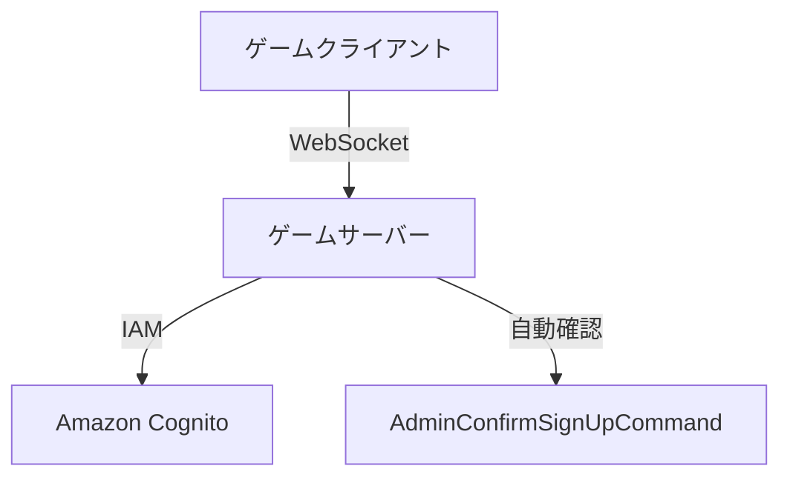
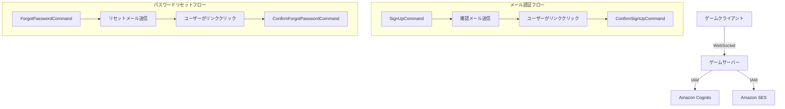

# 設計ドキュメント

## 概要

Spirit of Kiroゲームにメール認証とパスワードリセット機能を追加します。現在のAmazon Cognito認証システムを拡張し、セキュリティを向上させながらユーザーエクスペリエンスを改善します。

## アーキテクチャ

### 現在のシステム


### 新しいシステム


## コンポーネントと インターフェース

### 1. WebSocketメッセージハンドラー

#### 新しいメッセージタイプ
```typescript
// メール認証関連
interface ConfirmEmailMessage {
    type: 'confirm-email';
    body: {
        username: string;
        confirmationCode: string;
    };
}

interface ResendConfirmationMessage {
    type: 'resend-confirmation';
    body: {
        username: string;
    };
}

// パスワードリセット関連
interface ForgotPasswordMessage {
    type: 'forgot-password';
    body: {
        username: string;
    };
}

interface ResetPasswordMessage {
    type: 'reset-password';
    body: {
        username: string;
        confirmationCode: string;
        newPassword: string;
    };
}
```

#### 新しいハンドラー
- `confirm-email.ts` - メール認証確認
- `resend-confirmation.ts` - 確認メール再送信
- `forgot-password.ts` - パスワードリセット要求
- `reset-password.ts` - パスワードリセット実行

### 2. Cognitoサービス統合

#### 使用するCognito API
```typescript
// メール認証
import { 
    ConfirmSignUpCommand,
    ResendConfirmationCodeCommand 
} from '@aws-sdk/client-cognito-identity-provider';

// パスワードリセット
import { 
    ForgotPasswordCommand,
    ConfirmForgotPasswordCommand 
} from '@aws-sdk/client-cognito-identity-provider';
```

#### Cognito設定変更
- User Pool設定でメール認証を有効化
- SESとの統合設定
- メールテンプレートのカスタマイズ

### 3. メール送信システム

#### SES設定
```typescript
export const SES_CONFIG = {
    region: getEnv('AWS_REGION') || 'us-west-2',
    fromEmail: getEnv('SES_FROM_EMAIL') || 'noreply@spiritofkiro.com',
    replyToEmail: getEnv('SES_REPLY_TO_EMAIL') || 'support@spiritofkiro.com'
};
```

#### メールテンプレート
- **確認メール**: アカウント認証用
- **パスワードリセットメール**: パスワード変更用
- **HTMLとテキスト両方の形式**をサポート

### 4. クライアントサイドUI

#### 新しいVueコンポーネント
- `EmailConfirmation.vue` - メール認証画面
- `ForgotPassword.vue` - パスワードリセット要求画面
- `ResetPassword.vue` - 新しいパスワード設定画面
- `EmailSentNotification.vue` - メール送信通知コンポーネント

#### ルーティング更新
```typescript
// 新しいルート
{
    path: '/confirm-email',
    name: 'EmailConfirmation',
    component: EmailConfirmation
},
{
    path: '/forgot-password',
    name: 'ForgotPassword',
    component: ForgotPassword
},
{
    path: '/reset-password',
    name: 'ResetPassword',
    component: ResetPassword
}
```

## データモデル

### 既存のユーザーモデル拡張
```typescript
interface User {
    userId: string;
    username: string;
    email: string;
    emailVerified: boolean;  // 新規追加
    createdAt: string;
    lastLoginAt?: string;
}
```

### セッション状態管理
```typescript
interface ConnectionState {
    ws: ServerWebSocket;
    userId?: string;
    username?: string;
    emailVerified?: boolean;  // 新規追加
}
```

## エラーハンドリング

### エラータイプ定義
```typescript
enum AuthErrorType {
    EMAIL_NOT_VERIFIED = 'email_not_verified',
    INVALID_CONFIRMATION_CODE = 'invalid_confirmation_code',
    EXPIRED_CODE = 'expired_code',
    USER_NOT_FOUND = 'user_not_found',
    RATE_LIMIT_EXCEEDED = 'rate_limit_exceeded',
    EMAIL_SEND_FAILED = 'email_send_failed'
}
```

### エラーレスポンス形式
```typescript
interface AuthErrorResponse {
    type: string;
    error: AuthErrorType;
    message: string;
    retryAfter?: number;  // レート制限の場合
}
```

### エラーハンドリング戦略
1. **Cognitoエラー**: AWS SDKエラーを適切な日本語メッセージに変換
2. **SESエラー**: メール送信失敗時のフォールバック処理
3. **レート制限**: 適切なクールダウン時間の設定
4. **ネットワークエラー**: 再試行ロジックの実装

## テスト戦略

### ユニットテスト
- 各WebSocketハンドラーのテスト
- Cognitoサービス統合のモックテスト
- エラーハンドリングのテスト

### 統合テスト
- メール認証フロー全体のテスト
- パスワードリセットフロー全体のテスト
- SESメール送信のテスト

### E2Eテスト
- ユーザー登録からメール認証までの完全フロー
- パスワードリセットの完全フロー
- エラーケースのテスト

## セキュリティ考慮事項

### 1. トークンセキュリティ
- Cognitoが生成する確認コードは暗号学的に安全
- 確認コードの有効期限は24時間（Cognito設定）
- 使用済みトークンの自動無効化

### 2. レート制限
- **確認メール再送信**: 1時間に3回まで
- **パスワードリセット**: 1時間に5回まで（Cognito標準）
- **サインイン試行**: 連続失敗時のアカウントロック

### 3. メールセキュリティ
- SESのDKIM署名を有効化
- SPFレコードの設定
- DMARCポリシーの実装

### 4. セッション管理
- パスワード変更時の既存セッション無効化
- メール認証完了時のセッション更新

## パフォーマンス最適化

### 1. メール送信最適化
- SESのバッチ送信機能の活用（将来的な大量送信時）
- メール送信の非同期処理
- 送信失敗時の再試行ロジック

### 2. キャッシュ戦略
- 確認コード状態のRedisキャッシュ
- レート制限情報のキャッシュ
- ユーザー認証状態のキャッシュ

### 3. データベース最適化
- ユーザーテーブルのインデックス最適化
- 認証ログの効率的な保存

## 設定管理

### 環境変数
```bash
# SES設定
SES_FROM_EMAIL=noreply@spiritofkiro.com
SES_REPLY_TO_EMAIL=support@spiritofkiro.com

# Cognito設定（既存）
COGNITO_USER_POOL_ID=us-west-2_xxxxxxxxx
COGNITO_CLIENT_ID=xxxxxxxxxxxxxxxxxxxxxxxxxx

# メール設定
EMAIL_VERIFICATION_ENABLED=true
PASSWORD_RESET_ENABLED=true
```

### Cognito User Pool設定
```json
{
    "Policies": {
        "PasswordPolicy": {
            "MinimumLength": 8,
            "RequireUppercase": true,
            "RequireLowercase": true,
            "RequireNumbers": true,
            "RequireSymbols": false
        }
    },
    "AutoVerifiedAttributes": ["email"],
    "EmailConfiguration": {
        "EmailSendingAccount": "DEVELOPER",
        "SourceArn": "arn:aws:ses:us-west-2:123456789012:identity/spiritofkiro.com"
    },
    "EmailVerificationMessage": "Spirit of Kiroへようこそ！認証コード: {####}",
    "EmailVerificationSubject": "Spirit of Kiro - メール認証"
}
```

## デプロイメント考慮事項

### 1. インフラストラクチャ更新
- SESドメイン認証の設定
- IAMロールへのSES権限追加
- Cognito User Pool設定の更新

### 2. 段階的ロールアウト
1. **フェーズ1**: メール認証機能の実装とテスト
2. **フェーズ2**: パスワードリセット機能の追加
3. **フェーズ3**: UI/UXの改善と最適化

### 3. 監視とログ
- SESメール送信成功率の監視
- 認証フロー完了率の追跡
- エラー率とレスポンス時間の監視