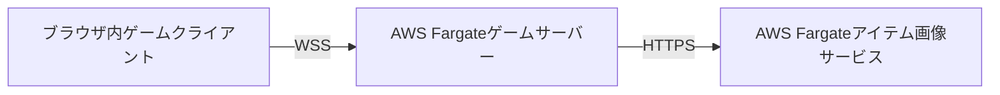
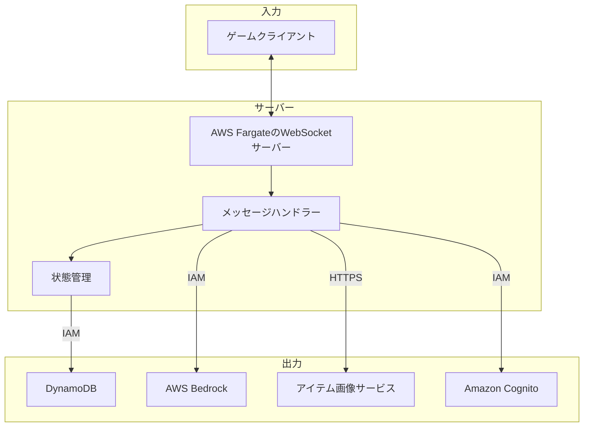
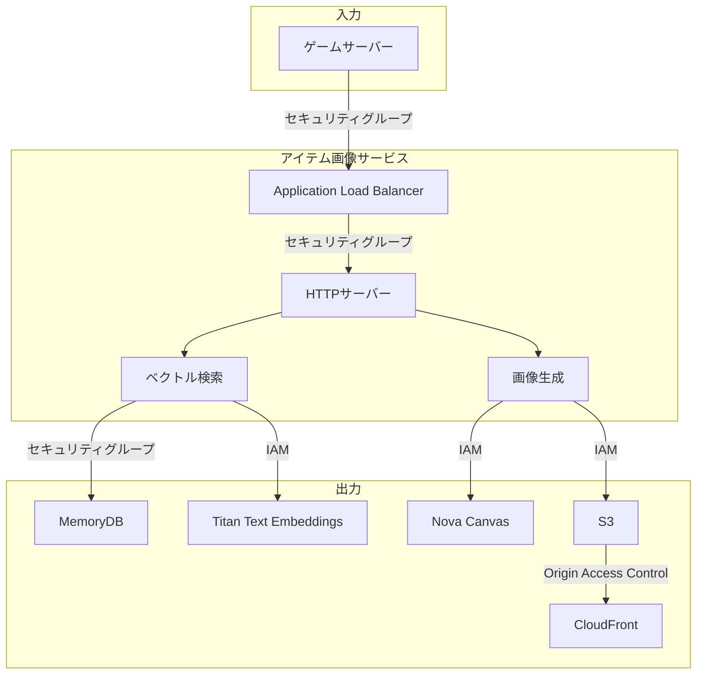

# アプリケーションセキュリティとアーキテクチャドキュメント

コンポーネントとそれらがどのように相互に通信するかの高レベル概要：



## ゲームクライアント

ゲームクライアントは、ユーザーのブラウザでユーザーインターフェースとゲーム体験を提供するVue.js 3シングルページアプリケーションです。ゲームサーバーへのWebSocket接続を通じて、サーバーとのリアルタイム状態同期を維持します。

```mermaid
graph TB
    subgraph プレイヤーブラウザ
        UI[実行中ゲームクライアント]
        Store[Piniaストア]
        Systems[ゲームシステム]
        UI --> Store
        Store <--> Systems
    end

    subgraph 外部
        WS[ゲームサーバー]
        ImageDist[画像CloudFront]
        FrontendDist[Lambda@Edge基本認証付きフロントエンドCloudFront]
    end

    subgraph ビルド
       Repo[クライアントソースコード]
       viteBuild[viteビルド]
       static[静的HTML、JS、画像アセット]
       S3[S3バケット]
       Repo --> viteBuild --> static --> S3
    end

    Systems <-->|WSS|WS
    UI -->|HTTPS|ImageDist
    UI -->|HTTPS|FrontendDist -->|Origin Access Control|S3
```

### 技術スタック
- **フレームワーク**: Composition APIを使用したVue.js 3
- **ビルドツール**: Vite
- **言語**: TypeScript
- **状態管理**: Pinia
- **ルーティング**: Vue Router
- **ホスティング**: CloudFront経由でアクセスされるS3

ゲームクライアントはViteを使用してビルドされ、S3バケット内に静的HTML、JS、CSS、画像アセットとしてホストされます。ブラウザはCloudFront経由でS3バケットから取得します。

### インバウンド接続
- プレイヤーのブラウザは、S3バケットをオリジンとして使用し、CloudFrontによって配信される静的な事前ビルドアセットとしてゲームクライアントを読み込みます。CloudFrontはOrigin Access Controlポリシーを使用してS3バケットから取得します。プレビューでは、CloudFrontにはパブリックアクセスを制限するHTTP基本認証を実装するLambda@Edge関数もあります。

### アウトバウンド接続
- クライアントを実行するブラウザは、様々な形式の状態を同期するために、CloudFront経由でWebSocketベースのゲームサーバーにWSSで接続します：
  - WebSocketハンドラーを介した認証（サインイン/サインアップ）
  - アイテム操作（取得、移動、破棄、鑑定、購入）
  - インベントリクエリと同期
  - 接続健全性のための定期的なping/pong
- クライアントを実行するブラウザは、動的に生成されたアイテム画像をホストするCloudFrontディストリビューションにHTTPS経由で接続
- クライアントを実行するブラウザは、ユーザーが新しい画面にアクセスする際にバックグラウンドで追加の静的な事前ビルドアセットを読み込むために、自身のCloudFrontディストリビューションにHTTPS経由で接続

## ゲームサーバー

ゲームサーバーは、ゲーム状態を管理し、プレイヤー認証を行い、クライアントと外部サービス間の相互作用を調整するBunベースのWebSocketサーバーです。永続ストレージにDynamoDBを使用し、AI駆動のアイテム生成のためにAWS Bedrockと統合します。ゲームアイテムの動的画像を作成する下流の画像生成サービスを呼び出します。



### 技術スタック
- **ランタイム**: Bun
- **言語**: TypeScript
- **WebSocket**: ネイティブBun WebSocketサーバー
- **データベース**: Amazon DynamoDB
- **ホスティング**: Amazon ECSによって調整されるAWS Fargate
- **AIサービス**: AWS Bedrock

### インバウンド接続
- **CloudFront**経由でのゲームクライアントからのWebSocket接続

### アウトバウンド接続
1. ゲームサーバーは**DynamoDB**にデータを永続化します。ゲームサーバーは以下のテーブルとの通信権限を付与するためにECSタスクIAMロールを使用します：
   - `Users`テーブル: ユーザーアカウントメタデータ
   - `Usernames`テーブル: ユーザー名をユーザーIDにマッピング
   - `Items`テーブル: ゲームアイテムメタデータ
   - `Inventory`テーブル: インベントリIDからアイテムへのマッピング
   - `Location`テーブル: アイテムIDからインベントリIDへのマッピング
   - `Persona`テーブル: プレイヤーキャラクターに関するメタデータ

2. ゲームサーバーは**Amazon Cognito**を介してユーザーを認証します
   - ゲームサーバーはトークンの検証とユーザー管理の権限を付与するためにECSタスクIAMロールを使用
   - WebSocket接続のJWTトークン検証を実装
   - ユーザーセッションと認証状態を管理

3. ゲームサーバーは**アイテム画像サービス**から画像URLをリクエストします
   - サーバーの前面にあるApplication Load BalancerへのHTTPSリクエスト
   - JSON応答を返すシンプルなRESTサーバー

4. ゲームサーバーは**AWS Bedrock**を使用します
   - ゲームサーバーはBedrock API呼び出しを行う権限を付与するためにECSタスクIAMロールを使用
   - LLMは新しいアイテムの生成、アイテム間の動的相互作用のモデル化、販売用アイテムの鑑定に使用
   - サーバーは以下のモデルを順番に再試行とフォールバックを実装：Anthropic Sonnet 4、Anthropic Sonnet 3.7、Amazon Nova Pro

## アイテム画像サービス

アイテム画像サービスは、ゲームアイテム画像の生成、保存、取得を処理する専用マイクロサービスです。コスト削減策として、MemoryDBでベクトル検索機能を使用して類似画像のインデックス作成と検索を行います。Amazon Nova Canvasを使用して画像を生成し、S3に画像を保存し、CloudFront経由で提供します。



### 技術スタック
- **ランタイム**: Bun
- **言語**: TypeScript
- **ホスティング**: Amazon ECSによって調整されるAWS Fargate
- **データベース**: AWS MemoryDB（Redis互換）
- **ストレージ**: Amazon S3
- **CDN**: CloudFront
- **AIサービス**: 
  - Amazon Titan Text Embeddings v2
  - Amazon Nova Canvas

### インバウンド接続

- 画像生成のためのゲームサーバーからのHTTPSリクエスト。リクエストはHTTPS Application Load Balancer経由で入り、AWS FargateでホストされるBunコンテナ間で分散されます。

### アウトバウンド接続
1. **MemoryDB**
   - 類似の生成画像を検索するベクトルデータベース
   - MemoryDBには、このサービスのセキュリティグループからのインバウンド接続のみを許可するセキュリティグループがあります

2. **S3**
   - 生成画像のストレージ
   - アイテム画像サービスには、S3バケットにアイテムを追加する権限を付与するIAMロールがあります
   - パブリックACLなし、CloudFrontはOrigin Access Controlポリシー経由でバケットにアクセス

4. **AIサービス**
   - ベクトルデータベースに保存できる埋め込みのためのTitan Text Embeddings
   - 画像生成のためのNova Canvas
   - アイテム画像サービスには、Bedrockと通信する権限を付与するIAMロールがあります

