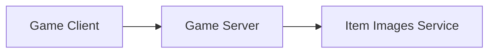
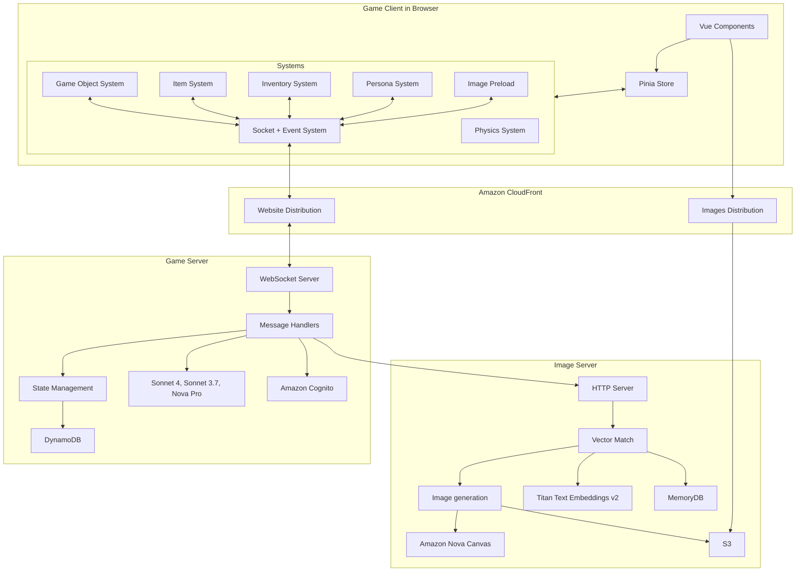

# Spirit of Kiro ゲームドキュメント

このゲームはクライアントサーバーアーキテクチャを使用しています。主要な3つのコンポーネントがあります：

## ゲームクライアント:
  * ゲームオブジェクトをVueコンポーネントとして表現する
    Vue.jsベースのゲームエンジン
  * 様々な画面サイズに適応する柔軟なタイルグリッドシステム
  * インタラクティブなゲームオブジェクト（ディスペンサー、作業台、ゴミ箱、収納チェスト、コンピューター）
  * 物理ベースの移動と衝突システム
  
## ゲームサーバー:
  * クライアントとサーバー間の低遅延双方向通信のためのWebSocketプロトコル
  * インベントリとアイテムメタデータのDynamoDBストレージ
  * 以下の機能を提供するAWS Bedrock統合:
     * ランダムアイテム生成。無限のアイテムバリエーション。生成AIによって
       書かれたユニークなアイテム名、説明、ダメージ、スキル
     * クラフティング。アイテムを現実的な方法で変換、改良、組み合わせ、消費
     * 鑑定。クラフトしたアイテムを売却してAIがどの程度の価値があると
       考えるかを確認
  * ユーザー認証と認可のためのAmazon Cognito統合
  
## アイテム画像サーバー:
  * 以下の機能を提供するAWS Bedrock統合:
    * 生成されたアイテムのユニークな画像を生成するAmazon Nova Canvas
    * アイテム説明のベクトル埋め込みを生成するAmazon Titan Text Embeddings v2
  * 新しいアイテム画像リクエストに対して以前に生成されたアイテム画像のベクトルマッチングを行うAmazon MemoryDBベクトルデータベース
  * アイテム画像を保存するS3、イングレスとしてのCloudFrontディストリビューション

## アーキテクチャマップ

以下のマップは、エンドツーエンドアーキテクチャを通じた関係とデータフローを示しています：

## フロントエンドゲームクライアントシステム

クライアントはVue.js 3で構築され、全体を通してComposition APIを使用しています。アーキテクチャは以下の主要パターンに従います：

- **コンポーネントベースUI**: すべてのゲームUI要素にVueコンポーネントを使用
- **システムベースアーキテクチャ**: ゲームロジックは、イベントを通じて相互に連携する独立したシステムに分離
- **リアクティブ状態管理**: PiniaとVueのリアクティビティシステムを使用
- **サーバー駆動イベント**: サーバーからのWebSocketイベントがフロントエンドイベントシステムに供給され、ゲーム状態の変更を駆動

### ソケットシステム
- 切断時の再接続を含む、WebSocketサーバーへの接続を管理
- サーバーにWebSocketメッセージを送信するメソッドを提供
- サーバーからの受信メッセージを、そのメッセージを購読している他のシステムに配信

### ゲームオブジェクトシステム
- 画面に描画されるすべてのゲームオブジェクトを追跡
- オブジェクトの作成、更新、削除を処理

### 物理システム
- オブジェクトの移動、衝突、重力を含む、ゲームオブジェクトのすべての物理計算と衝突検出を処理
- 異なるタイプの物理相互作用（静的、動的、フィールド）をサポート
- バウンス、摩擦、質量ベースの相互作用を実装

### アイテムシステム
- すべてのゲームアイテムとそのプロパティを追跡
- イベント購読を通じてサーバー状態と同期

### インベントリシステム
- アイテムがどのインベントリにあるかを追跡
- アイテムの拾得、ドロップ、転送を処理
- イベント購読を通じてサーバー状態と同期

### ペルソナシステム
- プレイヤーペルソナとキャラクターデータを管理
- ペルソナのカスタマイズと状態を処理
- イベント購読を通じてサーバー状態と同期

### プリローダーシステム
- アセットの読み込みと初期化を管理
- 読み込み進行状況を追跡
- イベント購読を使用して新しい画像の読み込みを監視

## サーバーアーキテクチャ

サーバーは以下を処理するBunベースのWebSocketサーバーです：

- リアルタイムゲーム状態同期
- メッセージベース通信
- アイテム生成のためのAI統合
- AWSサービスを使用した状態永続化

## インフラストラクチャ

ゲームは以下のためにAWSサービスを使用します：

- CloudFrontディストリビューション
- AI生成画像のためのS3ストレージ
- 状態永続化のためのDynamoDB
- AI統合のためのBedrock

## 開発

プロジェクトは以下の個別コンテナでローカル開発にDockerを使用します：
- クライアント（Vue.jsアプリケーション）
- サーバー（Bun WebSocketサーバー）
- インフラストラクチャデプロイメント
